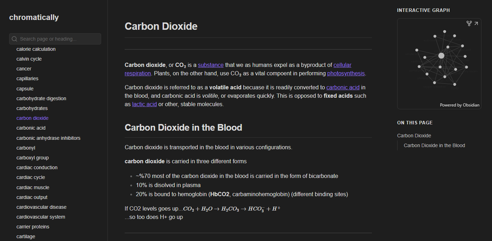

# GITHUB BLOG 이전 공지

## 이전하게 된 계기

사실 공부해왔던 자료들과 정보 아카이브 용으로 지금까지 Github blog를 정말 기존까지 잘 사용하고 있어 왔다. 하지만 항상 있었던 불편 사항은,

1. 배보다 배꼽이 크다

    - 블로그가 Ruby, Jekyll과 같이 친숙하지 않은 언어들로 빌드 되다 보니, 굳이 공부하지 않아도 될 프론트엔드 언어들까지 손대야 했으며, HTML, CSS에 대한 공부까지 해야 했다. 물론 마크업언어들에 관심이 없었던 것은 아니나, 정말 내 인생에서 다시는(?) 쓸 데 없는 공부들이라 의미를 찾지 못했다.

    - 또한, 분류하는 체계에 있어서도 문제가 발생했는데, TOC, layout, taxonomy와 같은 Jekyll 자체의 좋은 기능들을 정말 늦게 이해했고, 이를 완벽하게 활용하기 위해서는 더 많은 공부가 필요하다는 점을 깨달았다. 사람들이 블로그를 0부터 만드는 것이 아니라 테마를 쓰는데는 모두 이유가 있었던 것이다. 네이버, 티스토리 블로그에서는 너무나도 당연히 지원되는 카테고리, 세부 카테고리, 카테고리 내부에 들어있는 글 수를 괄호안에 표시하는 작업 등을 모두 직접 구현해야 했으며, 구현은 했지만 이를 적용하고 CSS로 예쁘게 꾸미기에는 내가 너무나도 게을렀다. 그거 하루종일 잡고 있어도 진척이 늘지 않는데 그시간에 롤 한판 하고 말지. 나는 공대생이지 프론트엔드 개발자나 디자이너가 아니기 때문에 더욱 이 작업에 할애하는 시간이 아깝게 느껴졌다.

    - 블로그나 생각 정리 체계를 추스르는 시간 자체가 낭비이다. 이렇게 정리하는 것에는 정리하는 행위 자체가 목적이 아니라 정리한 내용을 망각하지 않고 재사용함에 있는데, 여기에 시간을 너무 허비하는 짓은 목적이 아닌 그 수단에 집착하는 행위라고 느껴진다. 더불어 심미적 깔끔함을 탐닉하는 행위 또한 낭비의 일종이라고 생각된다. 예를 들자면 이런거다. 여러 종류의 짐을 들고가기 위해 가방을 준비했는데, 가방 안에 모든 물건을 어떻게 하면 모두 쑤셔넣을 수 있을지를 고민하다가 가방 없이 맨손으로 2번 물건을 나른 사람보다 늦어진 것이다. 

2. Archive에 너무나도 최적화된 나머지, PARA의 나머지 기능이 빈약하다.

    - 후술하겠지만 PARA, Project, Area, Resources, Archive라는 4가지 개념으로 정리하는 체계가 참 매력적으로 느껴져 이를 채용하게 되었는데, 이 접근법으로 생각해 보았을 때 github blog는 Archive에만 최적화되어 있지, 나머지 기능들을 수행하기 힘들다.

    - Project, Area는 주로 캘린더에 대응되는 앱을 이용하여 수행되는데, 과제, 시험공부 준비와 같은 Deadline이 정해져 있으며 goal이 있는 것들이 project에, 데드라인은 없지만 꾸준히 신경써주어야 하는 건강관리, 재무관리와 같은 것들이 area에 들어가게 된다. 사실 Project, Area 관리 앱도 따로 알아보고 있었는데, 너무나도 유명한 노션을 사용해볼까 했다. 그러나 노션은 뭐랄까... 내가 쓰기엔 너무 인싸틱하다. 너무 잡다한 기능이 많고, 예쁘게 꾸미는데 치중된 느낌이 강했다. 

    - Resources는 에버노트, 인터넷의 북마크 등이 이미 이 기능을 수행하고 있었는데, 차후에 필요할 것 같은 정보들을 스크랩 해두거나, 브레인스토밍한 결과를 모아두는 곳이다. 주로 크롬의 북마크를 이용해 두었는데, 이번에 모 모바일 게임 챔미를 준비하면서 내가 직접 글을 작성해둘 필요성을 느끼기도 했다.

    - Archive는 내가 더 이상 사용하지 않는, 자료들의 모음으로 일종의 쓰레기통과 같은 역할이다. 언젠가 쓸만한? 필요한 자료들을 모아두는 곳이라고 보면 된다.

    - 이러한 크게 4가지의 분류에서 보았을 때 short-term, real-time으로 자주 접속하게 될 project와 area를 GITHUB blog를 활용하기에는 너무나도 아쉬운 점이 많았다. 

3. 심미성의 측면에서 아쉽다.

    - 앞서 심미성은 낭비라는 말을 해놓고 역설적이라고 할 수도 있겠는데, 맞다. 나는 역설적으로 이쁜걸 좋아한다. 결정적으로, 내가 개발새발 만든 코드는 이쁘지가 않다.

## 그래서 어디로 이전하는가

- 결국 한 서비스에서 다른 서비스로 이전하는 것 자체가 익숙했던 적응 환경을 버리고(갈아타고) 새로운 적응을 해야하는 것이라 사실은 손해가 맞다. 그럼에도 쿨하게 이전을 택한 것은 후술할 앱이 진짜 잘 만들어졌다고 생각해서이다.

- 원래 이 앱을 알고는 있었다. 근데 왜 이전할 생각을 안했는지 지금 와서 다시 생각해보면, 유료라고 생각해서 망설여졌던 것 같다. 최근, 유튜브 알고리즘으로 이 앱을 접하고 갑자기 불이 붙어서 바로 대이주를 결정했다.

- 이 앱의 이롬은 바로 "Obsidian" 이다.

### 장점 

- 내가 생각하는 이 앱의 가장 큰 장점은, 통합성이다. 다른 캘린더, 시간관리 프로그램, 지식 저장소, 아카이브 등의 모든 것을 하나의 에코시스템 안에서 할 수 있으며, 각각의 markdown file의 객체들은 서로 링크와 백링크를 통해 연결성이 확보된다는 것이다. 마치 내 vault(개인 저장공간)이 작은 인트라넷이라도 되는 것 처럼 서로 연결할 수 있으며, 이를 visualization 할 수 있도록 graph view도 제공한다. (공대생의 무언가를 끓어오르게 하는.)

- 내장 기능들이 참 간단하다. VSCode, discord와 같은 앱들은 내가 지향하는 앱 스타일인데, 기본적으로 다크 테마이고, UI나 그 기능이 단순하다. 그렇다고 있을게 빠져있진 않다. Obsidian도 그런 것 같다.

- 내가 지금까지 써왔던 Markdown 파일들을 그대로 임포트할 수 있다. 물론 완벽히 그대로는 아니긴한데, 아예 버리는 것 보다야 훨씬 낫다고 생각한다. 또한 한번 체계를 갖추기 시작하면 거기에 문서를 추가하는 것은 기존의 네트워크에 새 파일을 연결시키기만 하면 되는 구조라 정말 간단하다. 

- 엔드포인트 사용자 입장에서, publish를 구독했다고 하면 정말 깔끔하게 내 저장고에 접근할 수 있다. github page는 (내가 정리를 잘 안해둔 탓도 있지만) 특정한 페이지에 접근하려면 중구남방으로 흩어진 파일들을 뒤져서 들어가야했고 이는 스트레스가 아닐 수 없었다. publish로 생각할 필요 없이 렌더링 되는 페이지를 통해 어떤 기기에서든지 깔끔하게 접속할 수 있다.

- PDF, 파일 관리에도 적합해 보인다. Goodnotes, Notability로 분산되어 있는 PDF와 수기 파일들 중 사용하지 않는 파일들(archive 용)은 모두 이쪽으로 옮겨올 생각이다.

- 너무나도 이쁘다.
    
    

    두말할 필요가 없다.

### 단점

- sync 기능이 빈약하다. 이걸 탓할 수는 없는게 대놓고 sync라는 plan이 존재하여 과금을 유도한다. 그렇지 않고서는 standalone으로 사용해야 하는데, 이는 git 플러그인을 이용하여 해결할 수 있다. 어차피 실제로 글을 쓰고 편집할 환경은 데스크톱/노트북/ 많아봤자 아이패드인데 셋 다 git을 잘 호환되도록 만들어 놨으므로, 이는 해결이다.

- publish 기능은 유료이다. 뭐, 안할건 아니니까 일단 한달 해보고 더 할지 결정할 것이다. 대신 스포티파이를 끊으면 제로섬이라 괜찮다.

- 필요없는 기능들이 있다. Bookmark(넘의 책도 북마크 안하는데, 내 글에 북마크할 일이 있을까.), Tags(쓰긴 쓸거라고 항상 생각하지만, 정작 카테고리가 그 기능을 다 해서 사용한적이 없는 것 같다.), 링크와 백링크 표시(사실 볼때나 의미가 있지 실제로 에디팅 할때는 의미가 없는 옵션.) 물론 설정을 더 만져보다보면, 필요없는 기능들을 disable할 수 있는 것 같아 보이니 커스터마이징 해야할 것이다.

- 추가로 늘어날 것 같긴한데, 일단은 한번 속아보려 한다. 